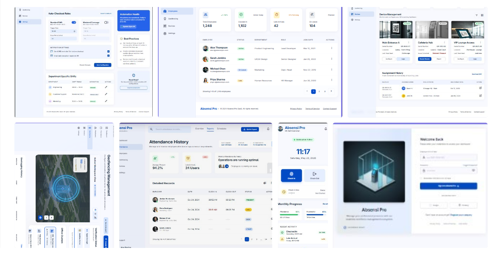

#  AbsensiProfile  
### Sistem Absensi Karyawan Berbasis GPS Geofencing & QR Code

<a href="#">
    
</a>
<a href="#">
    
</a>
<a href="#">
    
</a>
<a href="#">
    
</a>
<a href="#">
    
</a>

---

##  Preview



---

## 📌 Tentang Project

AbsensiProfile adalah aplikasi absensi modern berbasis web yang dibuat menggunakan Laravel 13 dan React Inertia.

Sistem ini mendukung:

- GPS Geofencing Realtime
- QR Attendance
- Dashboard Analytics
- Employee Management
- Responsive Modern UI
- Attendance Validation by Radius

Aplikasi ini dirancang untuk membantu perusahaan melakukan monitoring kehadiran karyawan secara realtime, modern, dan efisien.

---

# ✨ Fitur Utama

## 🔐 Authentication

- Login
- Register
- Logout
- Role Management
- Session Authentication

---

## 📊 Dashboard Analytics

- Statistik Kehadiran
- Statistik Karyawan
- Grafik Kehadiran
- Realtime Dashboard
- Monitoring Activity

---

## 👨‍💼 Employee Management

- Tambah Karyawan
- Edit Karyawan
- Hapus Karyawan
- Data Employee
- Employee Detail

---

## 📍 GPS Geofencing

- Live GPS Tracking
- Validasi Radius Kantor
- Dynamic Radius
- Realtime Geolocation
- Tracking Lokasi Employee
- Office Radius Detection

---

## 📷 QR Attendance

- QR Generator
- QR Scanner
- QR Check In
- QR Attendance Validation

---

## 📅 Attendance System

- Check In
- Check Out
- Attendance History
- Attendance Export
- Daily Attendance

---

## ⏰ Scheduler Otomatis

- Auto Check-Out
- Auto Attendance Monitoring
- Auto Daily Reset
- Auto Attendance Recap

---

## 🎨 Modern UI

- Responsive Design
- Mobile Friendly
- Modern Dashboard
- Professional HR UI
- Dark Clean Interface

---

# 🛠️ Framework dan Library Yang Digunakan

## Backend

- Laravel 13
- PHP 8.3
- MySQL

---

## Frontend

- React
- Inertia.js
- Tailwind CSS
- Vite

---

## Maps & GPS

- Leaflet.js
- React Leaflet
- OpenStreetMap
- Browser Geolocation API

---

## Library Tambahan

- Axios
- Lucide React
- React Icons

---

# 📸 Dokumentasi

## 🏠 Landing Page

Landing page modern dengan tampilan professional company.


---

## 🔐 Login Page

Halaman login modern dengan UI professional.


---

## 📊 Dashboard Admin

Dashboard analytics untuk monitoring absensi dan employee.


---

## 📍 GPS Geofencing

Sistem validasi absensi menggunakan GPS realtime dan radius kantor.


---

## 👨‍💼 Employee Management

Manajemen data karyawan realtime.


---

## 📷 QR Attendance

QR Code scanner untuk proses absensi.


---

# 📖 Cara Penggunaan

# A. Persyaratan

Sebelum menjalankan project, pastikan perangkat sudah memiliki:

- PHP 8.3+
- Composer
- Node.js
- NPM
- MySQL / MariaDB
- Git

---

# B. Instalasi

## 1. Clone Repository

```bash
git clone https://github.com/username/absensiprofile.git
```

---

## 2. Masuk Folder Project

```bash
cd absensiprofile
```

---

## 3. Install Dependency

```bash
composer install
npm install
```

---

## 4. Setup Environment

```bash
cp .env.example .env
```

---

## 5. Generate App Key

```bash
php artisan key:generate
```

---

## 6. Konfigurasi Database

Edit file `.env`

```env
APP_NAME=AbsensiProfile
APP_ENV=local
APP_KEY=
APP_DEBUG=true
APP_URL=http://127.0.0.1:8000

DB_CONNECTION=mysql
DB_HOST=127.0.0.1
DB_PORT=3306
DB_DATABASE=absensiprofile
DB_USERNAME=root
DB_PASSWORD=
```

---

## 7. Jalankan Migration

```bash
php artisan migrate
```

---

## 8. Jalankan Seeder

```bash
php artisan db:seed
```

Atau refresh database sekaligus seed:

```bash
php artisan migrate:fresh --seed
```

---

## 9. Jalankan Laravel Server

```bash
php artisan serve
```

---

## 10. Jalankan Vite

```bash
npm run dev
```

---

## 11. Akses Aplikasi

```txt
http://127.0.0.1:8000
```

---

# 👥 Daftar Roles

| Role | Akses |
|------|--------|
| Admin | Mengelola seluruh sistem |
| Employee | Melakukan absensi dan melihat dashboard |

---

# 📂 Import Data dari CSV

Admin dapat melakukan import employee menggunakan file CSV.

## Format CSV

```csv
name,email,position
John Doe,john@example.com,Staff
Jane Doe,jane@example.com,Manager
```

---

## Langkah Import CSV

1. Login sebagai Admin
2. Masuk menu Employee
3. Klik Import CSV
4. Upload file CSV
5. Data otomatis tersimpan

---

# ⚙️ Konfigurasi

## 📍 GPS Radius

Radius kantor dapat diubah melalui menu:

```txt
Admin > GPS Geofencing
```

---

## 🗺️ Office Location

Lokasi kantor dapat dipindahkan secara realtime melalui map GPS.

---

## ⚙️ Environment

Konfigurasi utama berada pada file:

```txt
.env
```

---

# 🗄️ Database Seeder

Seeder digunakan untuk membuat data awal aplikasi.

## Default Login Admin

```txt
Email    : admin@gmail.com
Password : password123
```

---

## Struktur Database

Database utama:

```txt
absensiprofile
```

Tabel utama:

- users
- employees
- attendances
- geofences
- devices
- qr_codes
- attendance_histories

---

# ⏰ Scheduler Otomatis

AbsensiProfile mendukung fitur scheduler otomatis untuk menjalankan proses tertentu secara realtime tanpa harus dijalankan manual.

---

## Fungsi Scheduler

- Auto Check-Out
- Reset Attendance Harian
- Update Status Kehadiran
- Attendance Monitoring
- Generate Attendance Recap

---

## Menjalankan Scheduler

### Manual

```bash
php artisan schedule:run
```

---

### Realtime Mode

```bash
php artisan schedule:work
```

---

## Scheduler Linux / Hosting

Tambahkan cron job:

```bash
* * * * * php /path-to-project/artisan schedule:run >> /dev/null 2>&1
```

---

## Contoh Scheduler Auto Checkout

```php
use Illuminate\Support\Facades\Schedule;

Schedule::call(function () {

    \App\Models\Attendance::whereDate('created_at', today())
        ->whereNull('check_out')
        ->update([
            'check_out' => now(),
        ]);

})->everyMinute();
```

---

# 📊 Feature Status

| Feature | Status |
|----------|--------|
| GPS Geofencing | ✅ |
| QR Attendance | ✅ |
| Dashboard Analytics | ✅ |
| Employee Management | ✅ |
| Scheduler Otomatis | ✅ |
| CSV Import | ✅ |
| Responsive UI | ✅ |

---

# 📌 Kesimpulan

AbsensiProfile adalah aplikasi absensi modern berbasis Laravel dan React yang dirancang untuk membantu perusahaan melakukan monitoring kehadiran secara realtime.

Dengan dukungan GPS Geofencing, QR Attendance, Dashboard Analytics, dan UI modern, sistem ini dapat digunakan sebagai solusi absensi digital berbasis web yang efisien dan professional.

Project ini juga dapat dikembangkan lebih lanjut menjadi:

- Face Recognition Attendance
- Mobile App Attendance
- Multi Branch Office
- Live Employee Tracking
- AI Attendance Monitoring

---

# 🤝 Contributing

Kontribusi terbuka untuk pengembangan project ini.

Jika menemukan bug atau memiliki ide pengembangan:

1. Fork repository
2. Create new branch
3. Commit changes
4. Open Pull Request

---

# 👨‍💻 Developer

Developed by:

### Thoriq Mplh

---

# 📄 License

This project is licensed under the MIT License.

---

⭐ Jangan lupa beri star jika project ini membantu.
